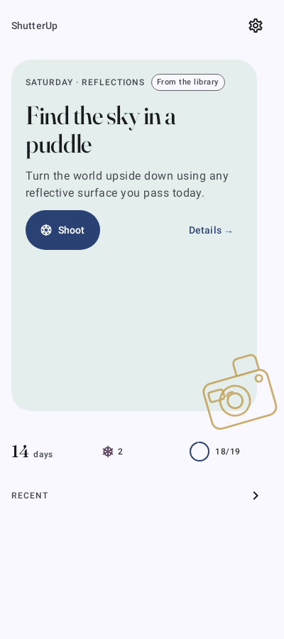
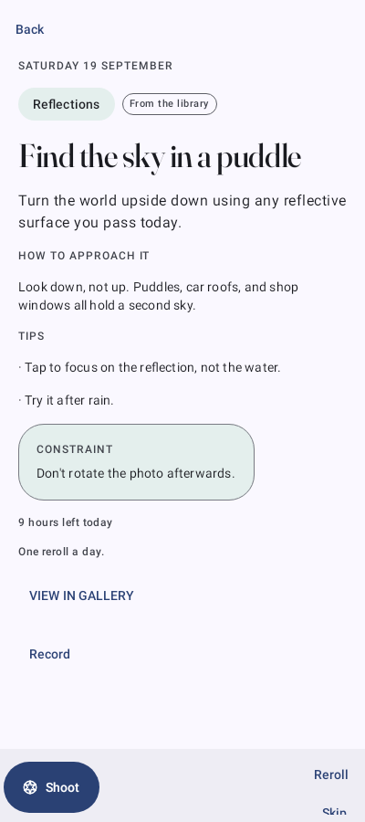
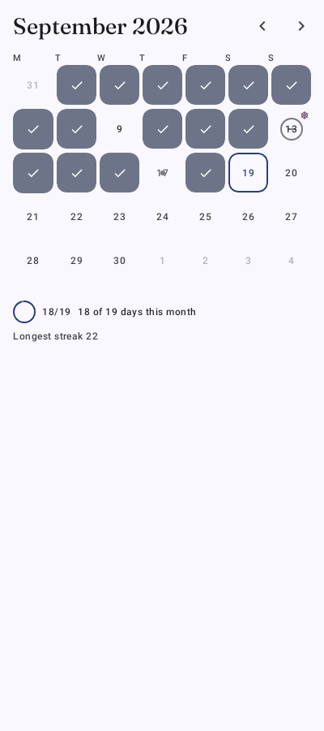
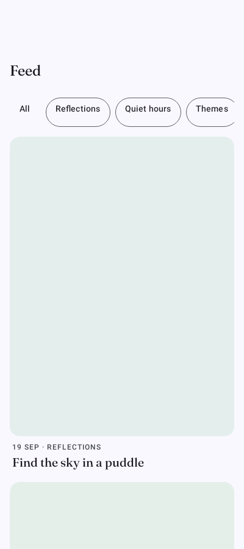
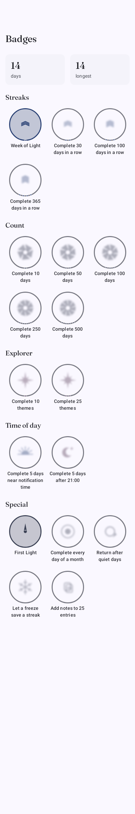
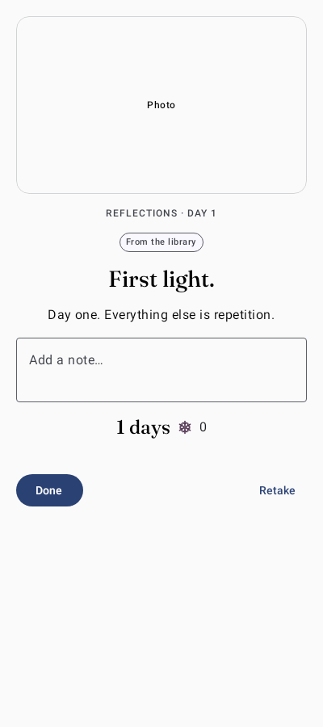

# ShutterUp

A fully offline Android app that sends you **one photography prompt a day**, generated on-device by Gemini Nano (with a built-in library fallback), hands off to the system camera, and keeps the photo with its prompt. Light gamification — streaks, freezes, badges — keeps the daily habit going without ever turning into a fanfare.

- [SPEC.md](SPEC.md) — product and technical specification
- [DESIGN.md](DESIGN.md) — design brief: look, motion, copy, badges, icon
- [PRIVACY.md](PRIVACY.md) — privacy policy: everything stays on device

## Screenshots

These are the Roborazzi screenshot-test references, so they are re-verified on every CI run and always match the app.

| Today | Prompt Detail | Calendar |
|---|---|---|
|  |  |  |

| Feed | Badges | Completion |
|---|---|---|
|  |  |  |

Dark-mode, large-font, and expanded-width (foldable) references live alongside these under `app/src/test/screenshots/`.

## Features

- **Daily prompts** — generated on-device via the ML Kit GenAI Prompt API (Gemini Nano v2, structured output), validated and de-duplicated, with a 220-prompt hand-written library fallback and 180-day exclusion
- **Quiet capture** — one still photo per day via the system camera into app-private storage; photo-picker fallback if the camera fails twice
- **Streaks, freezes, badges** — streak counting with pause/freeze semantics, 18 canvas-drawn badge emblems in five sections
- **History** — calendar month grid, chronological feed with theme filters, per-day view with notes
- **Reminders** — daily notification with Shoot/Reroll actions, exact-alarm precise-timing option, timezone/boot/update rescheduling
- **Glance widgets** (2×2 and 4×2) with deep links, 4-page first-run onboarding, adaptive layouts (bottom bar / rail / list-detail on foldables)
- **Fully offline** — no `INTERNET` permission (enforced by a manifest guard test), no accounts, no sync
- **Series** — opt-in weeks of seven related prompts, with a quiet seven-dot progress row; the daily loop stays one prompt and one photo a day

## Tech stack

Kotlin, Jetpack Compose (Material 3 + adaptive), Hilt, Room, DataStore, WorkManager/AlarmManager, Camera (system intents + FileProvider), ML Kit GenAI, Glance. Tests: JUnit4 + Robolectric + Roborazzi screenshot tests; instrumented Compose UI tests on the Fold 7 (`connectedDebugAndroidTest`).

## Building

Requirements: JDK 17 and the Android SDK (compile/target SDK 36).

```bash
./gradlew assembleDebug          # builds app/build/outputs/apk/debug/app-debug.apk
./gradlew testDebugUnitTest      # unit + Robolectric tests
./gradlew verifyRoborazziDebug   # verify screenshot references
./gradlew lint
./gradlew connectedDebugAndroidTest   # Compose UI tests on a plugged-in Fold 7 (SPEC §15.2)
```

To update screenshots after an intentional UI change: `./gradlew recordRoborazziDebug`, then review the diff before committing.

CI (`.github/workflows/ci.yml`) runs all four gates on every PR and uploads the debug APK. `.github/workflows/build-apk.yml` builds on-demand release/debug APKs; release signing comes from keystore secrets, otherwise the build falls back to the debug key.

## Project structure

```
app/src/main/java/app/shutterup/
  capture/        # FileProvider store, TakePicture contract, metadata
  data/           # Room (entities/DAOs), DataStore prefs, AI (Nano/library), repos
  domain/         # pure-Kotlin core: AI parsing/validation, gamification,
                  # scheduling, rollover, capture rules (no Android imports)
  navigation/     # deep-link URIs
  ui/             # theme, badges, components, screens (home/calendar/day/feed/
                  # badges/settings/detail/completion/onboarding), nav graph, adaptive
  widget/         # Glance widgets
  work/           # DailyPromptWorker, schedulers, receivers
app/src/main/assets/prompt_library.json   # 220 hand-written fallback prompts
```
